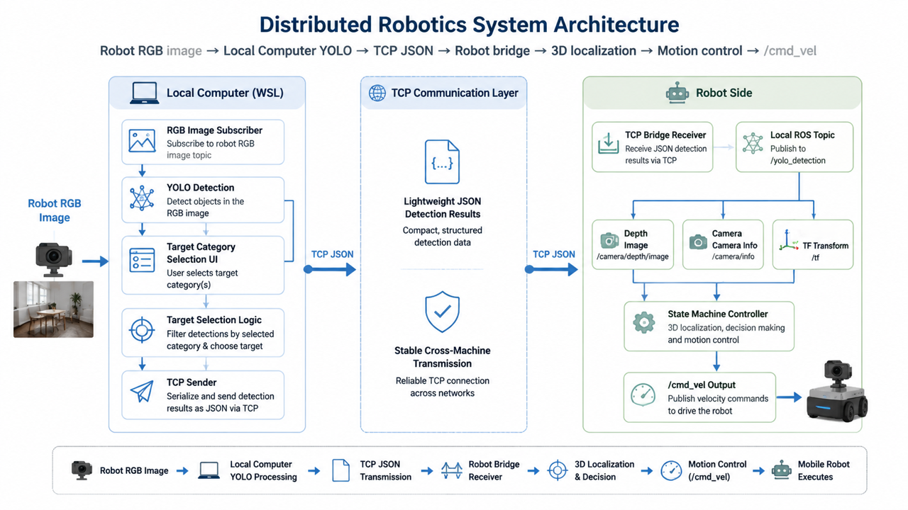
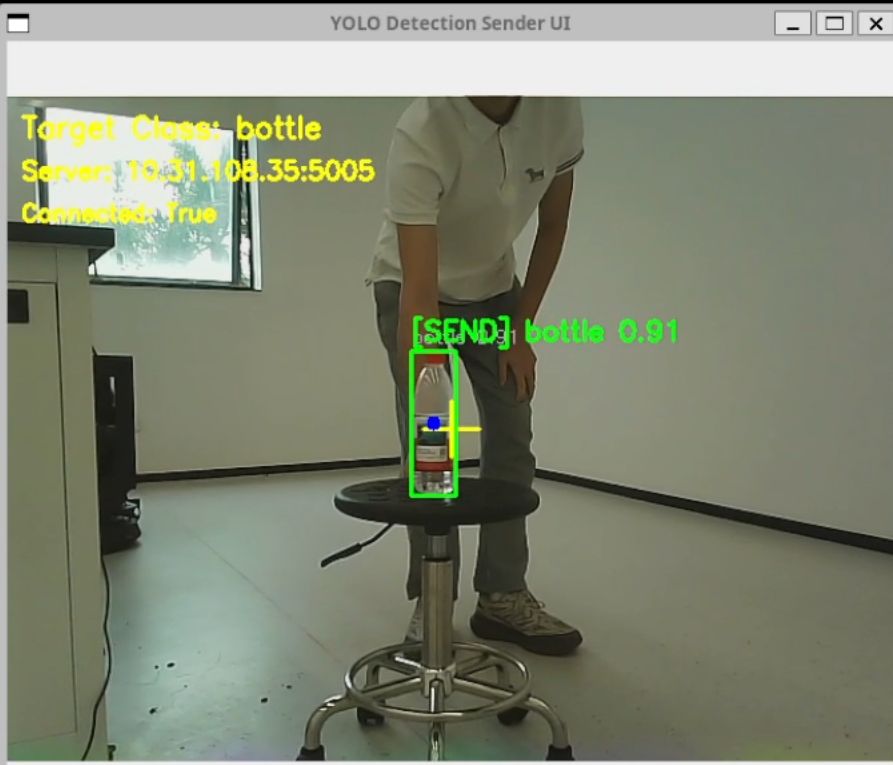
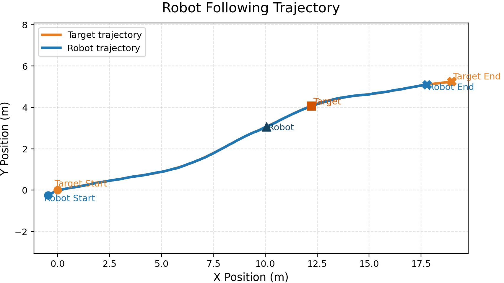
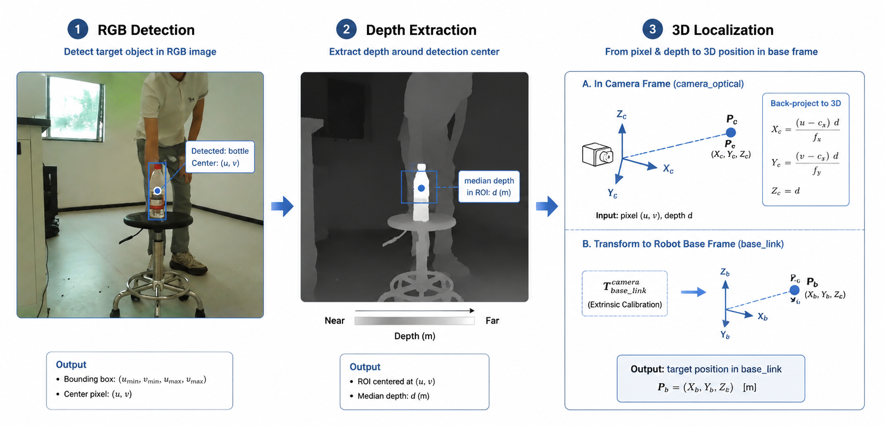

**Language / 语言：** [English](README.md) | [中文](README_cn.md)

---

# 基于 YOLO 的分布式语义目标跟随系统

这是一个基于 **ROS + YOLO + RGB-D + TCP bridge** 的分布式移动机器人语义目标识别与跟随系统。

本项目为 **AIE1902 具身智能课程期末项目**。  
与期中项目的基于 HSV 颜色跟踪方案相比，期末项目升级为：

- 语义目标检测
- 多类别目标切换
- RGB-D 三维定位
- 真实机器人部署
- 分布式架构
- TCP bridge 跨机检测传输

---

## 1. 项目简介

本系统用于在真实环境中完成语义目标跟随任务。  
用户可以通过界面选择目标类别，例如：

- `person`
- `chair`
- `bottle`
- `backpack`
- `cup`
- `laptop`
- `book`
- `cell phone`

系统会检测所选类别目标，并结合 RGB-D 数据估计其在机器人坐标系下的三维位置，然后驱动机器人进行自主跟随。

由于机器人板载计算能力有限，无法稳定运行实时 YOLO，因此本项目采用了**分布式部署**：

- **本地电脑 / WSL 端**：负责 YOLO 检测与目标类别选择
- **机器人端**：负责 TCP 接收、深度定位、TF 坐标变换和运动控制

由于我们在真实部署环境下发现原生 ROS 跨机检测 topic 传输不够稳定，因此最终使用 **TCP bridge** 来替代关键检测通道。

---

## 2. 仓库结构

```text
.
├── set_ros_robot.sh
├── set_ros_wsl.sh
├── WSL端·虚拟机端·本地电脑端
│   └── yolo_tracking
│       ├── CMakeLists.txt
│       ├── package.xml
│       ├── launch
│       │   └── wsl_all_in_one.launch
│       ├── models
│       │   └── yolo26s.pt
│       ├── msg
│       │   └── YoloDetection.msg
│       ├── scripts
│       │   ├── run_yolo_detector.sh
│       │   └── yolo_detector_sender_ui_node.py
│       ├── urdf
│       │   └── tb3_waffle_rgbd.gazebo.xacro
│       └── worlds
│           └── yolo_tracking_world.world
└── 机器人端
    └── yolo_tracking
        ├── CMakeLists.txt
        ├── package.xml
        ├── launch
        │   └── robot_all_in_one.launch
        ├── msg
        │   └── YoloDetection.msg
        └── scripts
            ├── yolo_detection_bridge_node.py
            └── yolo_node_release.py
```

---

## 3. 两端功能说明

### 3.1 WSL / 本地电脑端
负责：
- 订阅机器人 RGB 图像流
- 运行 YOLO 检测
- 提供目标类别切换 UI
- 进行目标筛选与目标选择
- 通过 TCP 将轻量检测结果发送给机器人

### 3.2 机器人端
负责：
- 运行机器人底层 bringup
- 通过 TCP 接收检测结果
- 将 JSON 重构为本地 ROS topic `/yolo_detection`
- 结合深度图和相机内参做三维定位
- 使用 TF 将目标变换到 `base_link`
- 运行状态机控制并发布 `/cmd_vel`

---

## 4. 系统整体架构



*图：分布式系统结构图，展示本地电脑端、TCP bridge 和机器人端的关系。*

整个系统可以分为三个主要层次：

### 4.1 本地电脑侧
- RGB 图像订阅
- YOLO 语义检测
- 目标类别选择 UI
- 目标选择逻辑
- JSON 编码 / TCP 发送

### 4.2 TCP 通信层
- 轻量 JSON 检测结果传输
- 稳定的跨机桥接通道

### 4.3 机器人侧
- TCP bridge 接收端
- 本地 ROS topic `/yolo_detection`
- 深度图 + 相机内参
- TF 坐标变换
- 状态机跟随控制
- `/cmd_vel` 输出

---

## 5. 核心功能

- 基于 YOLO 的语义目标检测
- 用户可切换目标类别
- 多类别目标跟随
- 基于 RGB-D 的三维定位
- 基于状态机的机器人跟随控制
- 速度平滑，降低抖动
- 目标丢失恢复
- 外部计算机 + 机器人分布式部署
- TCP bridge 跨机检测传输

---

## 6. 工作流程

完整执行流程如下：

1. 机器人发布 RGB 图像
2. 本地电脑订阅图像并运行 YOLO 检测
3. 用户通过 UI 选择目标类别
4. 检测器仅保留所选类别目标
5. 若有多个候选目标，则使用：
   - **最小移动优先**
   - **最大框回退**
6. 将最终检测结果封装为 JSON
7. 通过 TCP 发送给机器人
8. 机器人端 bridge 将 JSON 转换为本地 `/yolo_detection`
9. follower 结合：
   - `/yolo_detection`
   - 深度图
   - 相机内参
   - TF
10. 在 `base_link` 下估计目标三维位置
11. 发布 `/cmd_vel` 实现跟随

---

## 7. 环境脚本

仓库根目录提供两个环境脚本：

- `set_ros_robot.sh`
- `set_ros_wsl.sh`

### 7.1 机器人端脚本
请放到：

```bash
~/set_ros_robot.sh
```

### 7.2 WSL 端脚本
请放到：

```bash
~/set_ros_wsl.sh
```

脚本用于统一设置：
- `ROS_MASTER_URI`
- `ROS_IP`
- 工作空间环境
- 并清除可能导致问题的 `ROS_HOSTNAME`

---

## 8. 运行方法

### 8.1 机器人端

#### 终端 1：启动 ROS Master
```bash
source ~/set_ros_robot.sh
roscore
```

#### 终端 2：启动机器人端一体化 launch
```bash
source ~/set_ros_robot.sh
roslaunch yolo_tracking robot_all_in_one.launch
```

> `robot_all_in_one.launch` 包含：
> - 机器人 bringup
> - TCP bridge
> - robot-side follower

---

### 8.2 WSL / 本地电脑端

#### 启动本地端一体化节点
```bash
source ~/set_ros_wsl.sh
roslaunch yolo_tracking wsl_all_in_one.launch
```

如果你的 GPU / CUDA / Python 环境更适合 Python 3.10，而 `roslaunch` 不方便直接调用对应解释器，可以使用：

```bash
source ~/set_ros_wsl.sh
/usr/local/bin/python3.10 /home/<你的用户名>/catkin_ws/src/yolo_tracking/scripts/yolo_detector_sender_ui_node.py
```

这个节点同时提供：
- YOLO 检测
- 目标类别切换 UI
- TCP 发送到机器人

---

## 9. Ubuntu 20.04 源码安装 Python 3.10

如果本地电脑使用较新的 NVIDIA GPU（例如 RTX 50 系）或较新的 CUDA / PyTorch / Ultralytics 环境，那么 Ubuntu 20.04 默认的 Python 3.8 往往不够合适。此时建议**不要替换系统默认 Python**，而是通过**源码编译**单独安装 Python 3.10，供 YOLO 等检测节点使用。

### 9.1 设计原则

不要修改系统自带的：

```bash
/usr/bin/python
/usr/bin/python3
```

因为 Ubuntu 20.04 和 ROS Noetic 都依赖系统默认 Python。  
正确做法是把 Python 3.10 独立安装到 `/opt` 目录，例如：

```bash
/opt/python3.10.20
```

然后通过软链接提供独立命令：

```bash
/usr/local/bin/python3.10
/usr/local/bin/pip310
```

这样可以同时满足：

- 系统 Python 不受影响
- ROS Noetic 不受影响
- YOLO / PyTorch / Ultralytics 使用 Python 3.10

---

### 9.2 安装编译依赖

```bash
sudo apt update
sudo apt install -y \
  build-essential \
  zlib1g-dev \
  libncurses5-dev \
  libgdbm-dev \
  libnss3-dev \
  libssl-dev \
  libreadline-dev \
  libffi-dev \
  libsqlite3-dev \
  wget \
  libbz2-dev \
  liblzma-dev \
  tk-dev \
  uuid-dev \
  libxml2-dev \
  libxmlsec1-dev \
  xz-utils
```

这些依赖用于保证 Python 编译后具备常见模块支持，例如：

- `ssl`
- `sqlite3`
- `bz2`
- `lzma`
- `readline`
- `tkinter`

---

### 9.3 下载源码

以 Python 3.10.20 为例：

```bash
cd ~/Downloads
wget https://www.python.org/ftp/python/3.10.20/Python-3.10.20.tgz
```

---

### 9.4 解压源码

```bash
tar -xf Python-3.10.20.tgz
cd Python-3.10.20
```

---

### 9.5 配置编译参数

```bash
./configure --enable-optimizations --prefix=/opt/python3.10.20
```

说明：

- `--enable-optimizations`：启用优化编译
- `--prefix=/opt/python3.10.20`：安装到独立目录，不覆盖系统 Python

---

### 9.6 编译源码

```bash
make -j"$(nproc)"
```

---

### 9.7 安装到目标目录

```bash
sudo make install
```

安装完成后，Python 和 pip 位于：

```bash
/opt/python3.10.20/bin/python3.10
/opt/python3.10.20/bin/pip3.10
```

---

### 9.8 创建命令入口

为了方便后续使用，建立软链接：

```bash
sudo ln -sf /opt/python3.10.20/bin/python3.10 /usr/local/bin/python3.10
sudo ln -sf /opt/python3.10.20/bin/pip3.10 /usr/local/bin/pip310
```

之后即可直接使用：

```bash
python3.10
pip310
```

---

### 9.9 验证安装结果

```bash
python3.10 --version
pip310 --version
```

预期输出类似：

```text
Python 3.10.20
```

---

### 9.10 不要修改系统默认 Python

不要执行以下操作：

```bash
sudo ln -sf /opt/python3.10.20/bin/python3 /usr/bin/python3
```

也不要通过 `update-alternatives` 修改系统默认 `python3`。

原因是：

- Ubuntu 系统工具依赖默认 Python
- ROS Noetic 依赖系统 Python 3.8
- 修改默认 Python 容易导致系统或 ROS 环境异常

---

### 9.11 关于 pip 安装路径

如果 `/opt/python3.10.20` 对普通用户不可写，执行 `pip310 install ...` 时可能会看到：

```text
Defaulting to user installation because normal site-packages is not writeable
```

此时包装到了：

```bash
~/.local/lib/python3.10/site-packages
```

如果希望 Python 3.10 的依赖统一安装到 `/opt/python3.10.20` 中，便于集中管理，可执行：

```bash
sudo chown -R $USER:$USER /opt/python3.10.20
```

之后再执行：

```bash
pip310 install ...
```

通常就会安装到：

```bash
/opt/python3.10.20/lib/python3.10/site-packages
```

---

### 9.12 安装完成后的使用方式

后续涉及 YOLO / PyTorch / Ultralytics 的 Python 依赖时，统一使用：

```bash
python3.10
pip310
```

例如：

```bash
pip310 install torch torchvision torchaudio --index-url https://download.pytorch.org/whl/cu128
pip310 install ultralytics rospkg
```

如果 ROS 节点脚本需要显式指定 Python 3.10，可将脚本第一行 shebang 改为：

```python
#!/usr/local/bin/python3.10
```

这样可以确保检测节点运行在 Python 3.10 环境中，而不会破坏 ROS Noetic 所依赖的系统 Python 环境。

---

## 10. 为什么使用 TCP bridge 而不是纯 ROS 跨机 topic

我们最初尝试过原生 ROS 分布式 topic 通信：

- 机器人发布图像
- WSL 运行 YOLO
- WSL 直接通过 ROS 发布检测结果给机器人

在实际部署中，topic 发现是成功的，但跨机检测结果传输不够稳定，不适合作为闭环控制中的关键输入。

因此最终系统中，我们将这一关键检测通道改为 **TCP bridge**：

- 本地电脑主动发送轻量 JSON 检测结果
- 机器人通过固定端口接收
- 再在机器人端恢复成本地 ROS topic `/yolo_detection`

这样既保留了外部计算机的强算力优势，也保持了机器人侧控制链路的稳定性。

---

## 11. 支持的目标类别

UI 中预设支持的类别包括：

- person
- chair
- bottle
- backpack
- cup
- laptop
- book
- cell phone

在我们的实验中，最稳定的类别是：

- person
- chair
- bottle

---

## 12. 演示效果

### YOLO 检测效果


### 机器人跟随轨迹


### 基于深度的三维定位


---
## 13. 主要算法设计

### 13.1 目标选择
检测端使用：
- **最小移动优先**
- **最大框回退**

### 13.2 深度定位
机器人端使用：
- 边界框中心点
- 中心附近小区域深度中值
- 像素到相机坐标投影
- TF 变换到 `base_link`

### 13.3 跟随控制
机器人端 follower 使用四状态控制器：
- SEARCHING
- ALIGNING
- APPROACHING
- FOLLOWING

同时包含：
- 速度平滑
- 目标丢失恢复
- 直接跟随当前选中类别

---

## 14. 项目背景

本仓库对应 **AIE1902 具身智能课程期末项目**。

与期中项目相比：
- 期中系统：基于 HSV 的颜色跟踪
- 期末系统：升级为基于 YOLO 的语义目标跟随

同时增加了：
- 分布式部署
- TCP bridge 通信
- RGB-D 三维定位
- UI 目标类别切换
- 真实机器人跟随

因此本项目不仅是一个视觉检测 demo，而是一个完整的感知到行动闭环机器人系统。

---

## 15. 已知局限

- 小目标更容易受到深度噪声影响，远距离跟随不够稳定
- 当前系统重点是目标跟随，尚未集成避障
- 分布式架构仍依赖本地电脑与机器人之间的网络稳定性
- UI 支持的类别并不意味着所有类别在所有真实场景中都同样稳定

---

## 16. 未来工作

未来可考虑继续扩展：

- 集成 LiDAR 避障
- 多目标跟踪与重识别
- 动态目标轨迹预测
- 自适应深度 ROI
- Web 版或移动端 UI
- 与导航栈更紧密结合

---

## 17. 许可与学术使用说明

本仓库主要用于课程项目展示、学习和学术交流。

如果你在课程作业或演示中复用了本项目的大量内容，请注明原作者来源。

---

## 18. 致谢

感谢以下开源资源与支持：

- AIE1902 课程教师与助教
- ROS 与 OpenCV 社区
- Ultralytics YOLO 项目
- TurtleBot3 / Spark 机器人相关开源资源

---

https://github.com/user-attachments/assets/3814a260-a9da-4e35-8c45-480f7bd3a10d
